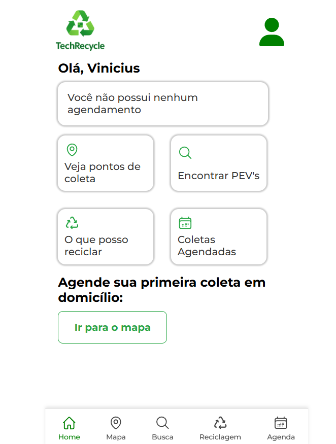
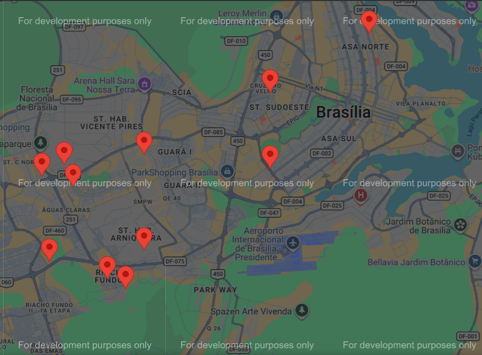
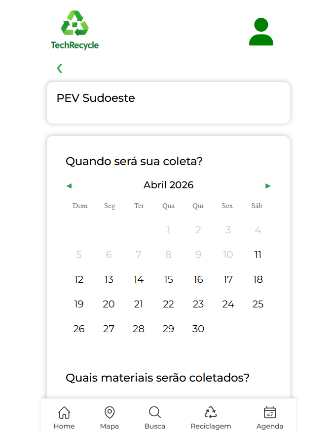
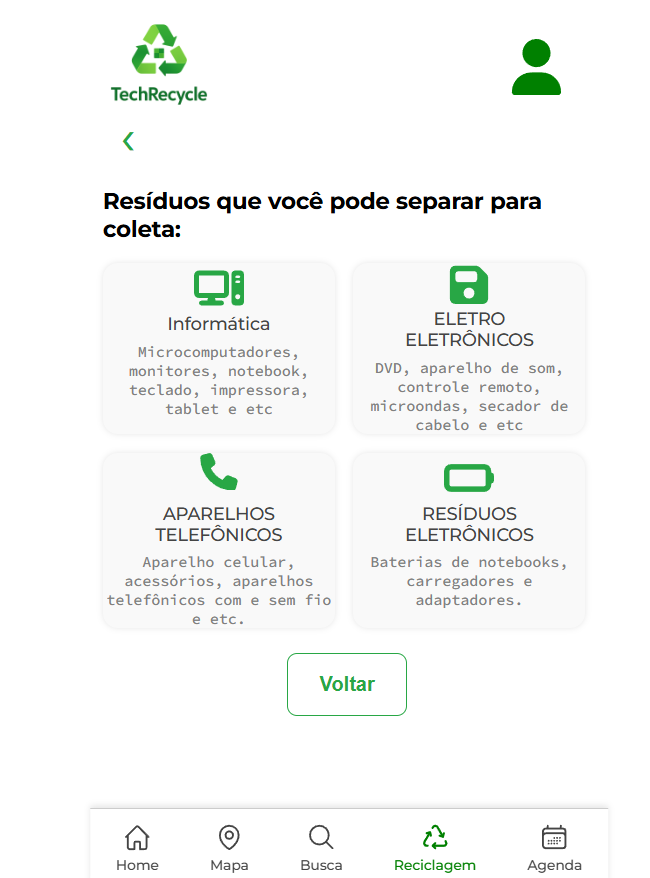

# 🌱 Tech-Recycle

Sistema web completo para **incentivar o descarte correto de resíduos eletrônicos**, permitindo cadastro de usuários, agendamento de coletas e visualização de pontos de reciclagem.

---

## 🌐 Acesse o projeto online
👉 https://techrecycle-production.up.railway.app

---

## 📸 Demonstração

### 🔐 Tela de Login
<p align="center">
  
</p>

### 🏠 Dashboard
<p align="center">
  
</p>

### 🗺️ Mapa de Coletas
<p align="center">
  
</p>

### ♻️ Agendamento de Coleta
<p align="center">
  
</p>

### 🌱 Informações de Reciclagem
<p align="center">
  
</p>

---

## 🚀 Funcionalidades

### 👤 Usuários
- Cadastro e autenticação com sessão
- Login e logout seguro

### ♻️ Coletas
- Agendamento de coleta domiciliar
- Reagendamento de coletas
- Cancelamento de coleta

### 🗺️ Mapa
- Visualização de pontos de coleta

---

## 🧠 Tecnologias Utilizadas

- **Node.js**
- **Express**
- **MySQL (Railway)**
- **Handlebars**
- **express-session**
- **bcrypt**
- **Jest + Supertest**

---

## 📁 Estrutura do Projeto


Tech-Recycle/
├── config/
├── controllers/
├── middlewares/
├── routes/
├── views/
├── assets/
│ └── img/
├── test/
├── src/
├── app.js
└── server.js


---

## ⚙️ Como rodar localmente

```bash
git clone https://github.com/vinibiielXp/TechRecycle.git
cd TechRecycle
npm install

Crie um arquivo .env:

DB_HOST=localhost
DB_USER=root
DB_PASSWORD=sua_senha
DB_NAME=techrecycle
SESSION_SECRET=secreto
npm start
🧪 Testes
npm test
Tipos de testes implementados:
✅ Testes unitários
✅ Testes de integração
✅ Testes funcionais
✅ Testes de template
🛡️ Segurança
Senhas criptografadas com bcrypt
Sessões com express-session
Proteção de rotas autenticadas
📊 Diferenciais do Projeto

✔️ Deploy em produção (Railway)
✔️ Integração com banco de dados real
✔️ Sistema completo (CRUD + autenticação)
✔️ Testes automatizados
✔️ Arquitetura organizada (MVC)

👨‍💻 Autor

Desenvolvido por Vinícius Gabriel 🚀